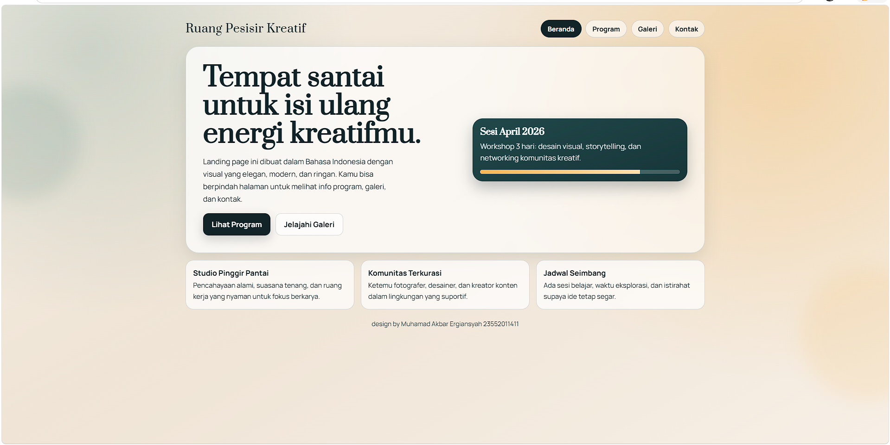
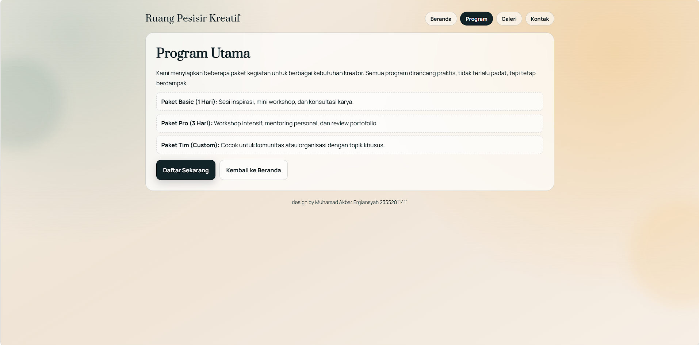
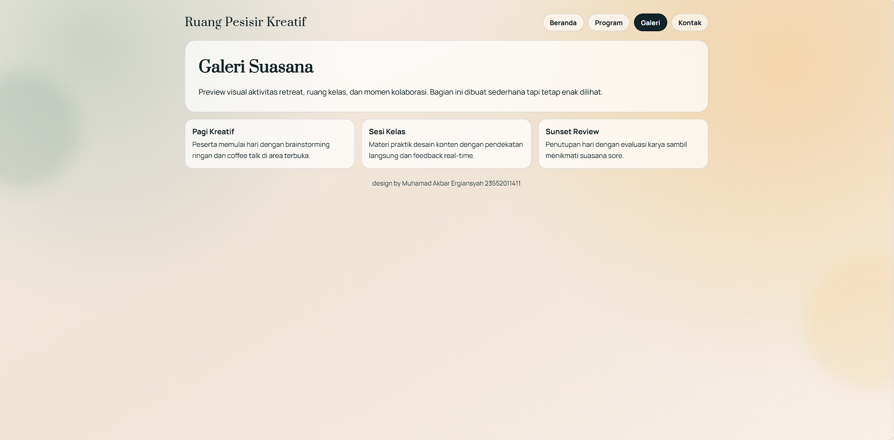
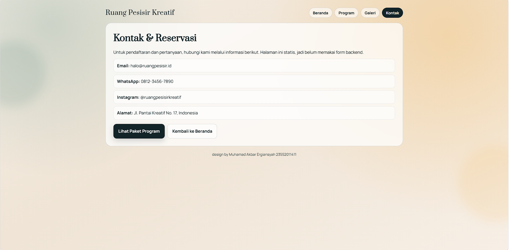

# Tugas 1 Pemrograman Web 2

Proyek ini adalah website statis bertema **retreat kreatif pesisir** berbasis Laravel (Blade) dengan fokus pada visual modern, ringan, dan responsif.

## Fitur Utama

- Landing page multi-halaman (tanpa login)
- Bahasa Indonesia untuk seluruh konten
- Navigasi antar halaman:
	- Beranda
	- Program
	- Galeri
	- Kontak
- Desain responsif untuk desktop dan mobile
- Footer watermark:
	- `design by Muhamad Akbar Ergiansyah 23552011411`

## Teknologi

- PHP 8+
- Laravel 12
- Blade Template
- CSS murni (tanpa framework UI tambahan)

## Struktur Halaman

- `/` -> Beranda
- `/program` -> Informasi program kegiatan
- `/galeri` -> Showcase suasana/konten galeri
- `/kontak` -> Informasi kontak dan reservasi

## Cara Menjalankan

1. Install dependency:

```bash
composer install
```

2. Copy file env dan generate key:

```bash
cp .env.example .env
php artisan key:generate
```

3. Jalankan server lokal:

```bash
php artisan serve
```

4. Buka browser:

```text
http://127.0.0.1:8000
```

## Penjelasan Per Halaman

### 1. Beranda (`/`)

Halaman utama menampilkan identitas website, headline utama, deskripsi singkat konsep, dan tombol navigasi cepat ke halaman lain. Pada bagian bawah terdapat tiga kartu ringkas yang menjelaskan nilai utama layanan.



### 2. Program (`/program`)

Halaman ini berisi rincian paket kegiatan yang ditawarkan, mulai dari paket harian sampai paket tim. Struktur kontennya dibuat jelas agar informasi program mudah dipahami.



### 3. Galeri (`/galeri`)

Halaman galeri menampilkan gambaran suasana kegiatan melalui beberapa blok konten visual-informatif. Tujuannya untuk memberikan representasi atmosfer retreat secara cepat.



### 4. Kontak (`/kontak`)

Halaman kontak berisi informasi reservasi dan kanal komunikasi utama seperti email, WhatsApp, dan Instagram. Halaman ini menjadi titik akhir alur pengguna sebelum melakukan pendaftaran.



## Catatan

- Project ini tidak memerlukan autentikasi/login.
- Session, cache, dan queue sudah disetel agar bisa berjalan tanpa setup database wajib untuk demo visual.
